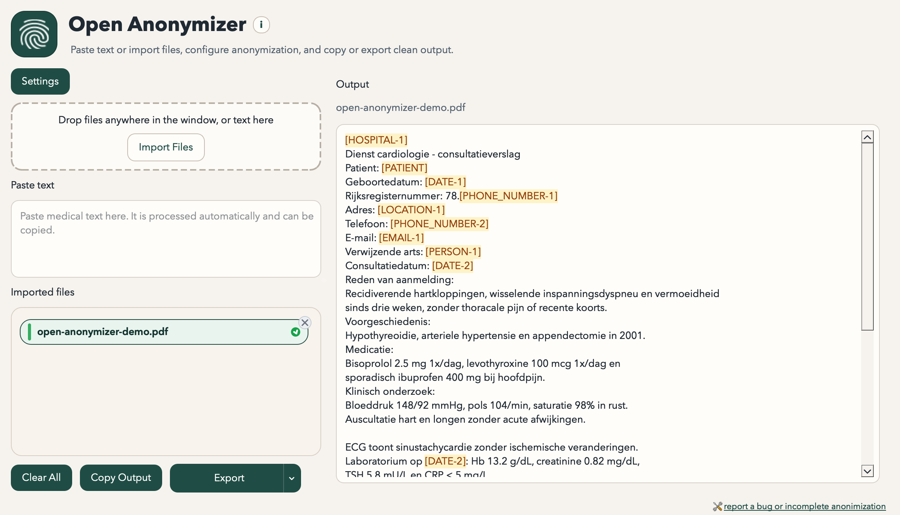

# Open Anonymizer

Open Anonymizer is a local desktop application for de-identifying Dutch and French medical text. It uses the [`belgian-deduce`](https://github.com/stighellemans/belgian-deduce) backend, published on PyPI as `belgian-deduce`, and wraps it in a drag-and-drop interface for pasted text, `.txt` files, `.html` files, and text-based `.pdf` files.



## Features

- Fully local processing. No network calls are required for de-identification.
- Drag and drop multiple `.txt`, `.html`, and `.pdf` files into the window.
- Paste raw text directly into the app and add it as a document.
- Open anonymization settings from a popup with patient first name, last name, birthdate, other people and addresses to always hide, and per-category recognition toggles.
- Switch between bracketed placeholders and smart pseudonyms for more readable review output.
- Bundle `belgian-deduce` 4.1.0 with broader Wallonia and Brussels lookup coverage for hospitals, institutions, and postal localities.
- Automatically de-identify newly added documents and re-run processing when anonymization settings change.
- Persist anonymization settings across launches.
- Review each processed document, copy the output, and export all successful results as a ZIP archive.
- Hover pseudonyms or placeholders in the review pane to see the original matched text.
- Keep imported HTML documents as HTML when exporting de-identified output back out.
- Track skipped documents with an `export-report.txt` summary inside the ZIP.
- Use backend-native English placeholders such as `[PATIENT]`, `[DATE-1]`, and `[PERSON-1]`.

## Tech Stack

- Python 3.9
- PySide6
- `belgian-deduce==4.1.0` from PyPI
- `pypdfium2` with `pypdf` fallbacks for text-based PDF extraction
- PyInstaller for desktop packaging

## Local Development

```bash
python3 -m venv .venv
source .venv/bin/activate
python -m pip install --upgrade pip
python -m pip install -e .[dev]
python main.py
```

During local development, OCR fallback uses `tesseract` from `PATH` unless a bundled runtime is present.

## Tests

```bash
pytest
```

Run the PDF starter corpus harness:

```bash
python scripts/run_pdf_corpus.py
```

## Build Python Packages

```bash
uv run --extra dev python -m build --sdist --wheel
uv run --extra dev python -m twine check dist/*.tar.gz dist/*.whl
```

Tagged `v*` pushes now publish a GitHub release with the desktop installers attached. The manual `Installer Artifacts` workflow builds the same installers without publishing a release.

## Build Desktop Artifacts

```bash
python -m pip install -e .[dev]
python scripts/build_desktop.py
```

The build output is written to `dist/`.

On Windows, turn the PyInstaller app folder into a single installer executable:

```bash
python scripts/build_windows_installer.py
```

That writes a `setup.exe` style installer to `release/`.

Tagged releases publish exactly these installer assets:

- `open-anonymizer-macos-arm64.dmg`
- `open-anonymizer-macos-x64.dmg`
- `open-anonymizer-windows-setup.exe`

## Packaging Notes

- v1 targets macOS and Windows.
- Tagged releases attach only the macOS and Windows installer files to the GitHub release.
- Public release assets are DMG installers on macOS and a `setup.exe` installer on Windows.
- PDF extraction prefers PDFium and falls back to `pypdf` heuristics for better spacing recovery.
- Scanned pages can use OCR fallback through bundled `tesseract_runtime` files inside the app, or through `tesseract` on `PATH` during development.
- To ship a click-and-play build with OCR included, stage a self-contained runtime in `vendor/tesseract_runtime/` before running `python scripts/build_desktop.py`. Use `python scripts/stage_tesseract_runtime.py /path/to/runtime` to copy a prepared runtime into place.
- The runtime should include `eng`, `fra`, `nld`, and `osd` traineddata files so Dutch/French OCR works automatically without a language choice prompt.
- Release assets are unsigned unless signing credentials are added later.
- The README screenshot can be regenerated with `./.venv/bin/python scripts/capture_readme_screenshot.py`, which writes `build/readme-demo/open-anonymizer-demo.pdf` before capturing the live window.

The parser test matrix is documented in [docs/pdf-test-matrix.md](docs/pdf-test-matrix.md).
The macOS signing/notarization flow is documented in [docs/macos-distribution.md](docs/macos-distribution.md).
The Windows installer flow is documented in [docs/windows-distribution.md](docs/windows-distribution.md).

## License

The application code in this repository is MIT licensed. The bundled `belgian-deduce` dependency remains subject to its own LGPLv3 license. See [THIRD_PARTY_NOTICES.md](THIRD_PARTY_NOTICES.md).
